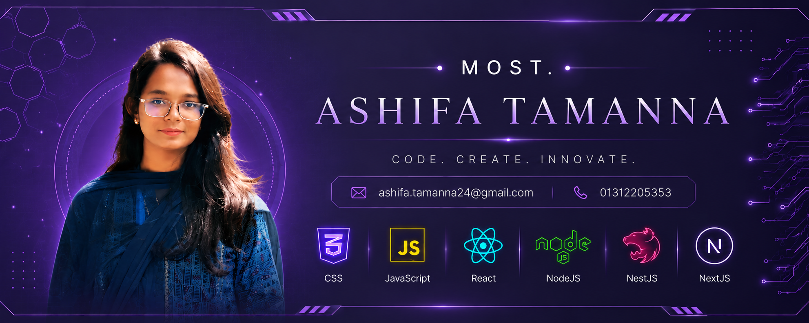

  

# Hi, I'm Ashifa Tamanna 👋

## 💫 About Me:
🔭 I’m currently working on full-stack web development projects  🌱 I’m currently learning React, Next.js, NestJS & PostgreSQL  👯 I’m looking to collaborate on innovative web applications and open-source projects  🤔 I’m looking for help with advanced full-stack development and best practices  💬 Ask me about Web Development, JavaScript, React, PHP & Databases  📫 How to reach me: ashifa.tamanna24@gmail.com

## 🌐 Socials:
  

# 💻 Tech Stack:
                 
# 📊 GitHub Stats:
 
 

## 🏆 GitHub Trophies

### ✍️ Random Dev Quote

### 🔝 Top Contributed Repo

---

<!-- Proudly created with GPRM ( https://gprm.itsvg.in ) -->
